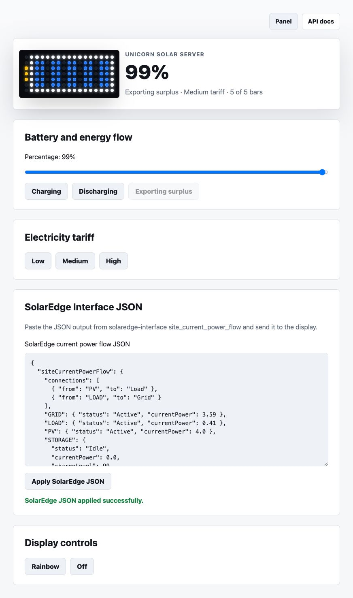

# Unicorn Solar Server

Display the battery, energy flow, and current electricity tariff of a domestic
solar installation on a Raspberry Pi with a Pimoroni Unicorn HAT Mini.

The project provides:

- A 17x7 battery display designed for Unicorn HAT Mini.
- A validated HTTP API for external solar-monitoring scripts.
- A dedicated API and web form for SolarEdge installations with solar panels
  and battery storage, accepting current power-flow JSON generated by
  [ndejong/solaredge-interface](https://github.com/ndejong/solaredge-interface).
- A responsive React control panel with a simulated matrix preview.
- Built-in API documentation.
- A systemd service and Raspberry Pi installation scripts.
- A hardware-free dummy mode for local development and automated tests.
- A startup rainbow that confirms the Unicorn HAT Mini is working before the
  first solar update arrives.



## Project lineage

Unicorn Solar Server is derived from
[aspaviento/unicorn-busy-server](https://github.com/aspaviento/unicorn-busy-server),
which is itself based on
[estruyf/unicorn-busy-server](https://github.com/estruyf/unicorn-busy-server).

The derived project reuses the Flask/Vite structure and Unicorn hardware
wrapper, but replaces the busy-light behavior with a solar battery display and
a dedicated API. It was developed with assistance from OpenAI Codex.

## Display

The server requires the Unicorn HAT Mini's native 17x7 orientation. It sets
rotation `0` and refuses to start with a different display shape so the battery
cannot be silently cropped or rotated.

- White pixels form the battery outline.
- Five inner blocks of two columns represent battery percentage, filling from
  right to left in 10% steps while preserving the gaps between blocks.
- `0-9%` lights no columns. Each additional 10% lights one column, so `20%`
  completes the first block, `40%` completes the second, and `100%` completes
  all five blocks.
- Green columns mean charging.
- Red columns mean discharging.
- Blue columns mean exporting surplus energy. Exporting is accepted only at
  `100%`.
- The three-pixel battery terminal represents the electricity tariff: green
  for low, yellow for medium, and red for high.

| Battery level | Active columns | Complete blocks |
|---:|---:|---:|
| `0-9%` | 0 | 0 |
| `10-19%` | 1 | 0 |
| `20-29%` | 2 | 1 |
| `30-39%` | 3 | 1 |
| `40-49%` | 4 | 2 |
| `50-59%` | 5 | 2 |
| `60-69%` | 6 | 3 |
| `70-79%` | 7 | 3 |
| `80-89%` | 8 | 4 |
| `90-99%` | 9 | 4 |
| `100%` | 10 | 5 |

## API

### Update battery

```http
POST /api/battery
Content-Type: application/json

{"percentage": 65, "flow": "charging"}
```

`percentage` accepts any number from `0` to `100`. `flow` accepts `charging`,
`discharging`, or `exporting`.

### Update from SolarEdge Interface

`POST /api/solaredge-interface` is designed for SolarEdge installations with
solar panels and battery storage. It accepts the JSON output produced by
[`ndejong/solaredge-interface`](https://github.com/ndejong/solaredge-interface):

```bash
solaredge-interface --format json site_current_power_flow <siteid> \
  | curl -X POST -H 'Content-Type: application/json' \
      --data-binary @- http://<raspberry-pi-ip>:9001/api/solaredge-interface
```

The endpoint uses `STORAGE.chargeLevel` for the battery percentage. The battery
flow follows `STORAGE.status`, while idle storage with exported power is
reported as `exporting`.

The control panel also includes a **SolarEdge Interface JSON** section where
the same JSON can be pasted and submitted manually.

The bar color follows the current power-flow connections and exported grid
power:

- Red when either of the first two connections originates from `GRID` or
  `STORAGE`.
- Blue when grid power is greater than `2.0`.
- Green when grid power is greater than `1.0`.
- Yellow otherwise.

### Update tariff

```http
POST /api/tariff
Content-Type: application/json

{"level": "low"}
```

`level` accepts `low`, `medium`, or `high`.

### Read status

```http
GET /api/status
```

The response includes the current solar state, `activeColumns` (`0-10`),
`activeBlocks` (`0-5` complete blocks), hardware type, display dimensions, and
rotation.

### Discover endpoints

```http
GET /api/
```

### Validate the display

The server starts with this rainbow animation instead of showing an empty
battery, making hardware and service startup failures easier to identify.

```http
POST /api/rainbow
Content-Type: application/json

{"brightness": 1, "speed": 0.1}
```

Both values are optional.

### Show standby clock

```http
GET /api/standby
```

`POST /api/standby` is also accepted. Standby shows a very dim `HH:MM` clock
 at brightness `0.05` for overnight visibility with minimal light. Repeated
standby calls are idempotent and keep the existing standby display running.
Any battery or tariff update stops standby and restores the solar display.

### Turn off the display

```http
GET /api/off
```

`POST /api/off` is also accepted. This stops any animation and turns off every
display pixel. Any battery or tariff update stops the rainbow, standby, or off
state and restores the solar display.

## Installation

The installer supports Raspberry Pi OS and Ubuntu:

```bash
curl -LSs https://raw.githubusercontent.com/aspaviento/unicorn-solar-server/master/install.sh | sudo bash -
```

Solar Server is installed as `unicorn-solar.service` and listens on port
`9001`.

```bash
systemctl status unicorn-solar.service
```

Open the control panel at:

```text
http://<raspberry-pi-ip>:9001/
```

## Home Assistant Integration

Home Assistant can monitor the running server through the built-in REST
integration and display the current matrix state in a Lovelace dashboard. See
[Home Assistant integration](./docs/home-assistant.md) for package and dashboard
YAML examples.

## Coexisting with Unicorn Busy Server

Both projects can be installed on the same Raspberry Pi:

| Project | systemd service | HTTP port |
|---|---|---:|
| Unicorn Busy Server | `busylight.service` | `9000` |
| Unicorn Solar Server | `unicorn-solar.service` | `9001` |

Only one service should control the Unicorn HAT Mini at a time. Solar Server's
systemd unit conflicts with `busylight.service`, so starting Solar Server stops
Busy Server. The installer also disables Busy Server to ensure Solar Server
remains the selected service after a reboot.

Activate Solar Server:

```bash
sudo systemctl disable --now busylight.service
sudo systemctl enable --now unicorn-solar.service
```

Return to Busy Server:

```bash
sudo systemctl disable --now unicorn-solar.service
sudo systemctl enable --now busylight.service
```

## Development

Create a Python environment and run the server:

```bash
python3 -m venv --system-site-packages .venv
.venv/bin/pip install flask flask-cors jsmin
.venv/bin/python server.py
```

Without compatible hardware, the wrapper automatically uses a 17x7 dummy
display. The server and control panel are available at
`http://localhost:9001/`.

Build the frontend:

```bash
cd frontend
npm install
npm run build
```

All user-facing frontend labels and descriptions are centralized in
`frontend/src/content.ts`.

Run the backend tests:

```bash
.venv/bin/python -m unittest -v
```

## License

Licensed under the MIT License. See [LICENSE](./LICENSE).
